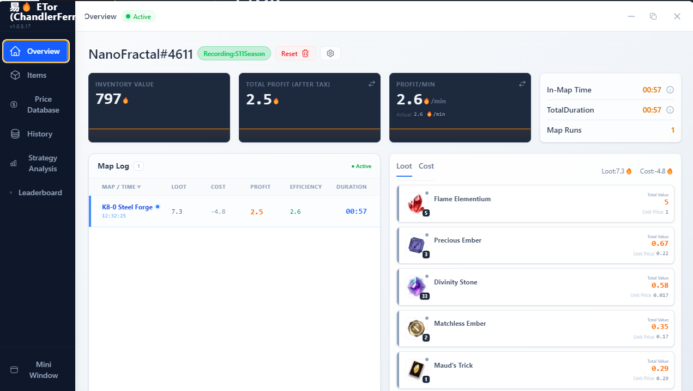
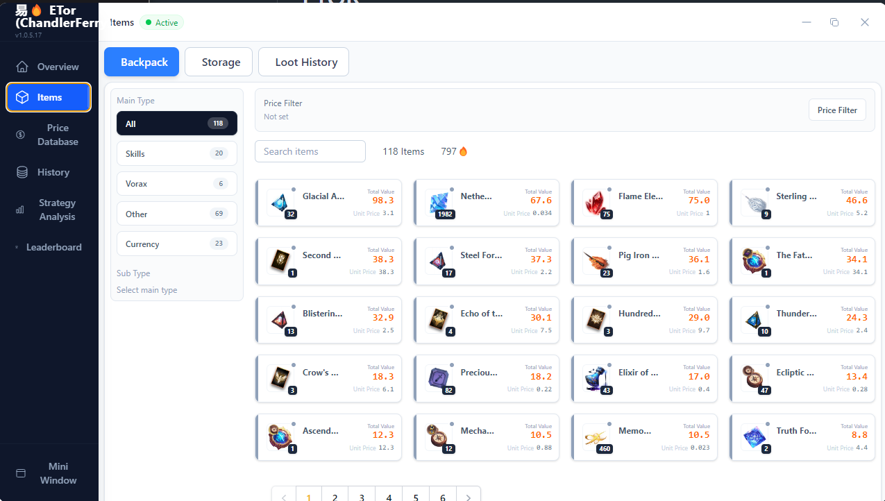
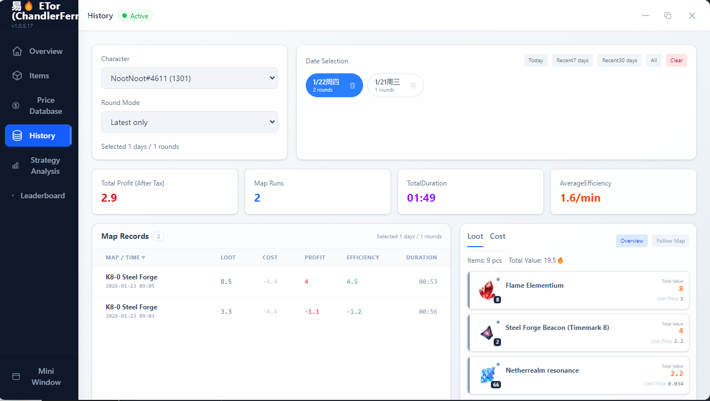
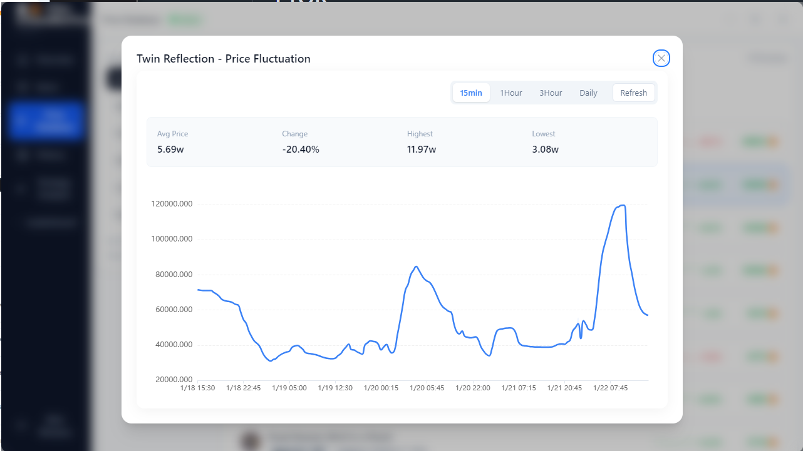
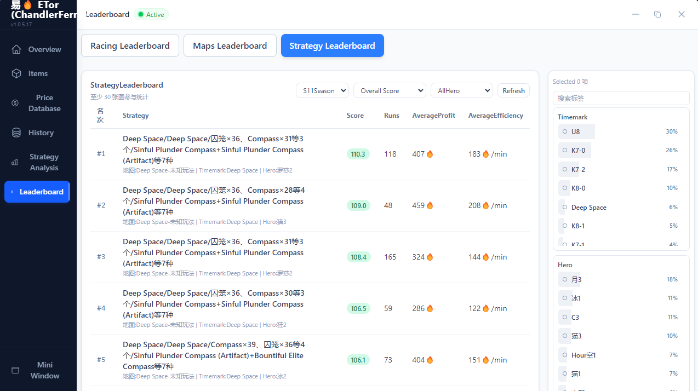
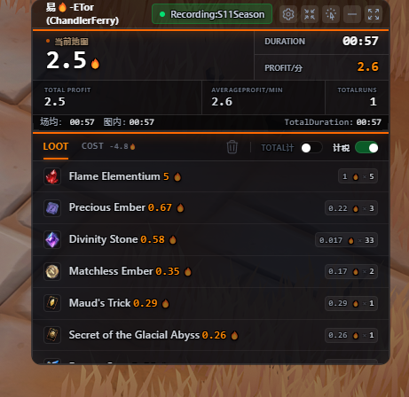

# 易火 ETor (CF) Translations for Torchlight Infinite (Loot Tracker, etc.)
[Donate @ Ko-fi](https://ko-fi.com/deafwave)

[Releases](https://github.com/ChandlerFerry/etor-translations/releases)

[FAQ](./docs/etor-faq.MD)

### Method 1: Pre-built (Recommended - includes Security Patches)
1. Go to [Releases](https://github.com/ChandlerFerry/etor-translations/releases)
2. Download and unzip the latest release.
3. Run the executable.

Releases are immutable, and automated via [GitHub Actions](https://github.com/ChandlerFerry/etor-translations/actions) for security.

### Method 2: Manual (No Security Patch)
This method requires you to have the [original ETOR application](./docs/etor-faq.MD#where-can-i-download-the-original-etor).

1. Open ETOR and press `Ctrl+Shift+I` to open the developer console.
2. In the console, type `allow pasting` and press Enter.
3. Copy the entire content of one of the language files below and paste it into the console, then press Enter.
    - [etor-english.js](https://raw.githubusercontent.com/ChandlerFerry/etor-translations/refs/heads/main/etor-english.js)
    - [etor-japanese.js](https://raw.githubusercontent.com/ChandlerFerry/etor-translations/refs/heads/main/etor-japanese.js)
    - [etor-korean.js](https://raw.githubusercontent.com/ChandlerFerry/etor-translations/refs/heads/main/etor-korean.js)
    - [etor-russian.js](https://raw.githubusercontent.com/ChandlerFerry/etor-translations/refs/heads/main/etor-russian.js)
4. Close the console.

## Showcase

<b>Click to see screenshots of what ETOR is capable of</b>

| Overview | Items |
|---|---|
| | |
| **History** | **Price Fluctuation** |
| | 
| **Leaderboard** | **Mini Window** |
| |  |

## Other Guides (WIP)
- [Carino Step-By-Step Build Guide](./docs/guides/carino.MD)
- [Tiered Strategies](./docs/guides/strategies_tiered.MD)
- [Pet Auto Switch Groups](./docs/guides/pet_auto_switch_groups.MD)
