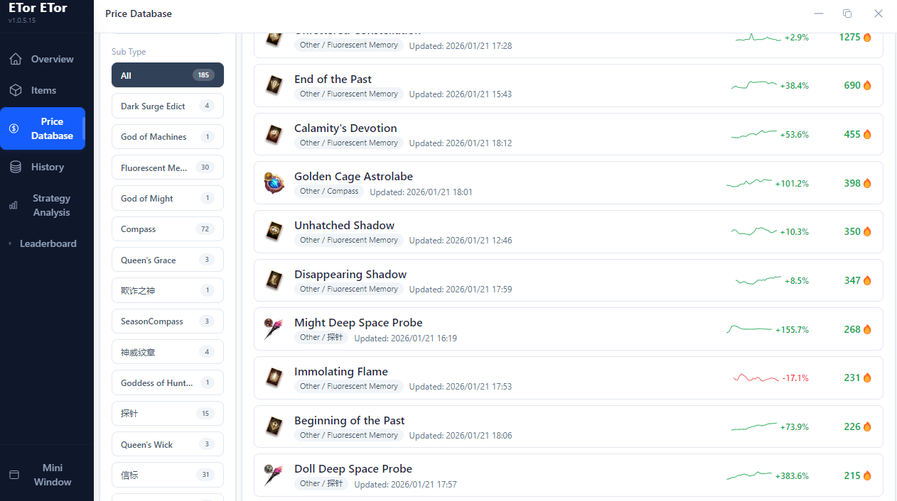

# ETOR

Poogf01 uses a tool called [ETOR](https://drive.google.com/file/d/1M8LGVXfD8DuQRS8prOuA9iDw3n2amVOZ/view) to track loot.

In his stream, you can use the command `!照妖鏡` to receive the download link

However, it is in Chinese.

## English
1. Open ETOR
2. Ctrl+Shift+I
3. Console Tab
4. Type `allow pasting` and press enter
5. Paste the data from [etor_english.js](./etor_english.js) & press enter

### Before:

### After
